# CLICKER-COMPETITON
CLICKER GAME BACK END (REST-API) DEVELOPED WITH **JAVA SPRING**. 
DATABASE BUILD BY **DOCKER CONTAINS** WITH MYSQL AND PHPMYADMIN RESPECTIVELY

## Developed with 🛠️

_Tools and technologies:_

* [IntelliJ IDEA](https://www.eclipse.org/) - IDE Project, JAVA.
* [OPEN JDK 11](https://openjdk.java.net/projects/jdk/11/) - JAVA 11.
* [Spring](https://mvnrepository.com/artifact/org.springframework.boot/spring-boot-starter-web) - Rest framework
* [Maven](https://mvnrepository.com/) - Dependency manager.
* [H2](https://mvnrepository.com/artifact/com.h2database/h2) - In-memory database
* [Mysql](https://mvnrepository.com/artifact/org.mariadb.jdbc/mariadb-java-client) - MySQL Connector
* [Docker](https://www.docker.com/) - Docker
* [Spring-Security](https://mvnrepository.com/artifact/org.springframework.security/spring-security-core) - Auth & Security.
* [Lombok](https://mvnrepository.com/artifact/org.projectlombok/lombok) - Entities data annotations.
* [JPA](https://mvnrepository.com/artifact/org.springframework.boot/spring-boot-starter-test) - database management framework 
* [Junit](https://mvnrepository.com/artifact/junit/junit/4.13) - Testing

_Copy all dependencies_
* [porn.xml](pom.xml) - Maven Project file
* [docker-compose-file](docker/docker-compose.yaml) - Mysql Service

### Structure: 🧱

* ***Secutiry:*** 🔒

    * From the security side, I have created a service in the Security package ***is.lojo.clickercompetition.demo.Security***;
    It acts as a filter using a list of roles based on the role of the player, who will be able to access one part of the application or another.
    
    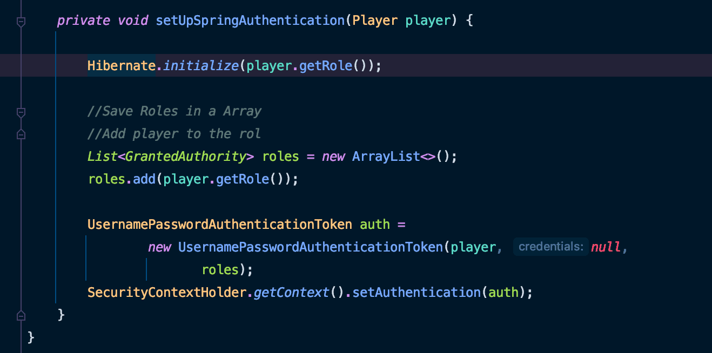
    
    * Permissions by roles are applied in the main of the application divided by routes.    
    
    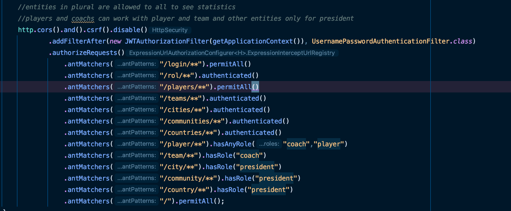

* ***Models:*** 👤
    * The program has 6 interrelated models
        * Country : Top level has One to Many relationship with Communities.
        * AutonomousCommunity : Second level has One to Many with Player.
        * City : Third level has One to Many with Players.
        * Player: Players are at the lowest level with teams and roles.
        * Role: Last level has One to Many relationship with player.
        * Team: Has Many to Many relationship with Player.
    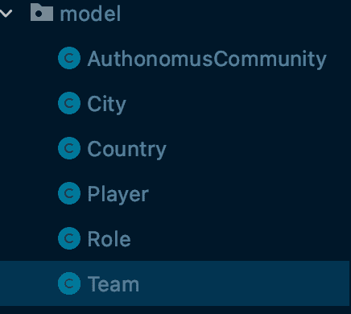
          
* ***Services:*** 📡
    * JWTAuthorizationFilter
        * establish security by roles
    * PlayerUtilitiesService
        * Player common funccions on loigin and update
    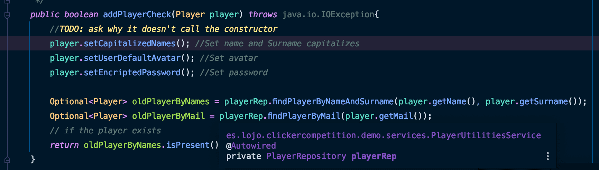
    * ImageService 
        * Player and Teams Avatar. with default or customs images
    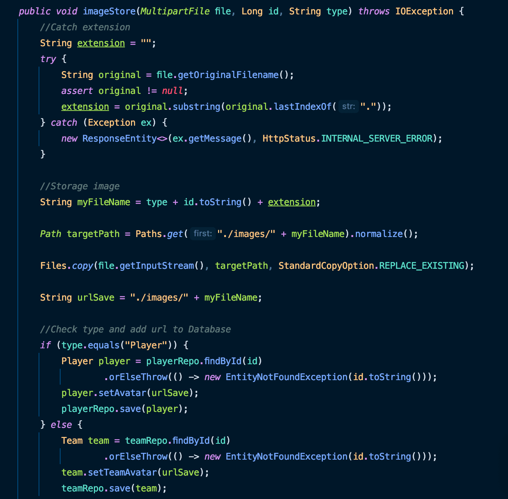
    
* ***Controllers:*** 🎛️
  * Except for the uploading of images, which is done using multipart-form-data. The rest of the controllers 
    handle access to the treatment of all data by routes sending and receiving information via JSON. The application 
    is divided into 4 controllers. Each of them associated with an entity, the main one is login () associated with 
    playerController, depending on the player's role, they will be able to access a series of routes within the application
    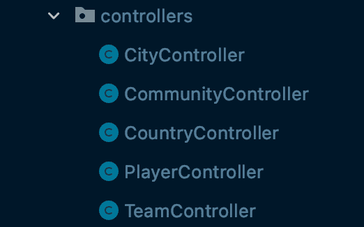
    
    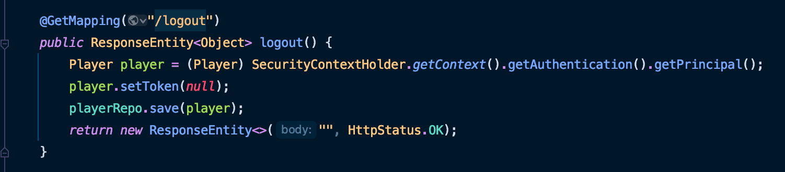

* ***Data Base:*** 📁
    * the project started using h2, at the end of development I switched to mysql. The database configuration 
      is in **resources.application.properties**
    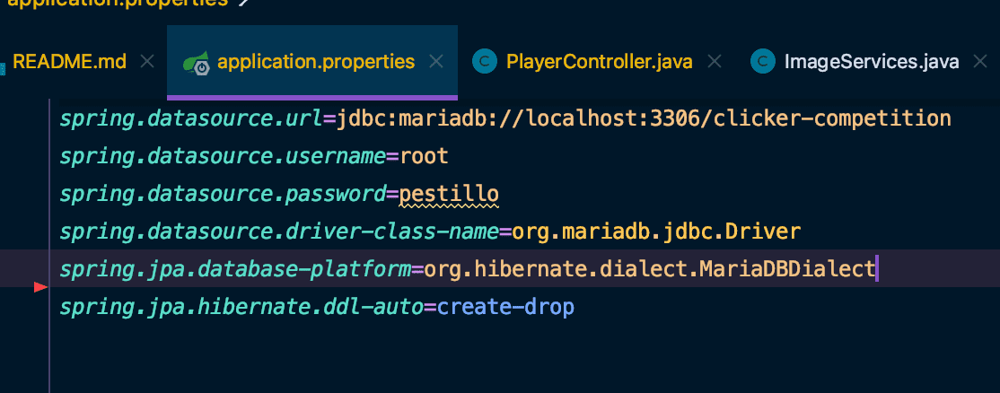
    * the database is built from two ***docker*** containers. your file is in **docker/docker-compose.yaml**
    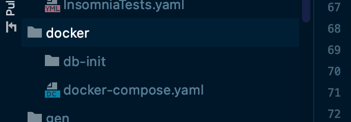
* The scripts are at ./sql directory .

---

# RUN AND TESTING ⚙️ 🔧

__to test it you will need__ 
    
    Project Dependencies. Copy all from porn.xml
    Insomnia app to import tests-files 


## Insomnia:

[Insomnia](https://insomnia.rest/) - Download app

Testing of all controllers send requests to the server.

### Run DataBase
    /docker
```
docker-compose up
```
    

### Execute tests 
    test/ApplicationTests
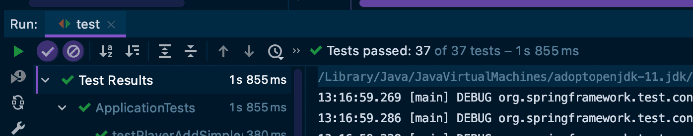

###Run app
    run Spring app by executing /Application

### Import data to imnsomnia app
    doc/insomniaTests.yaml
    doc/insomniaTests.json

### Check player roles at
* boostrap/seeder
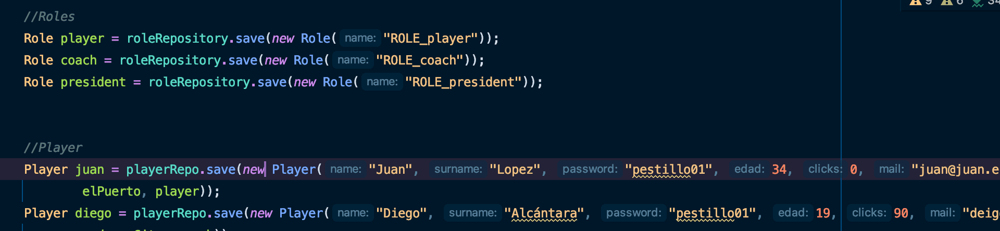
  
* Datbase 
    ```
    http://localhost:8081
    ```
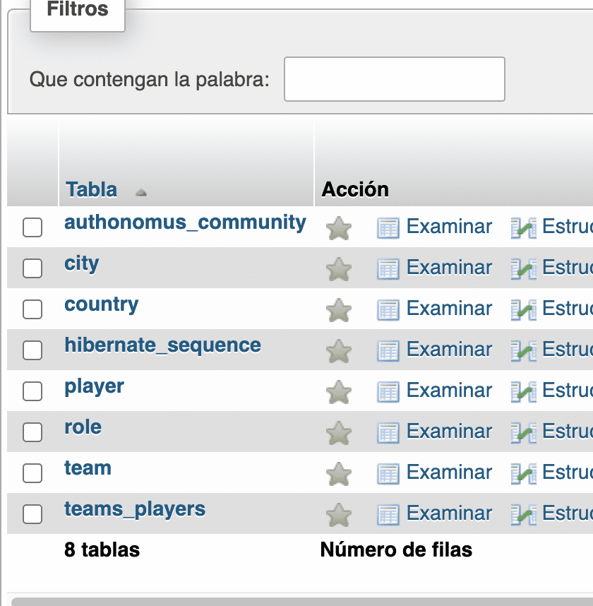

* Insomnia
    ```
    import data from /doc
    ```
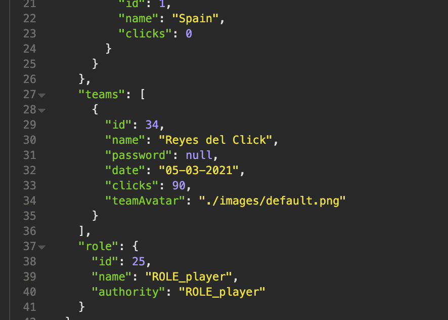

### Test all controllers response on Insomnia

---
## What can you do with it 😄

_Once you carry out the previous steps explained in the following points, you will be able to test my application and its functionalities._

### Login and Sign players with name and password
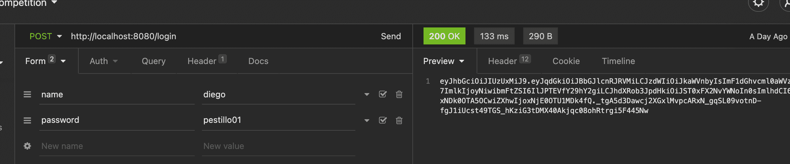
```
    Copy token and check other controllers
```
### classifications by clicks
TODO: CONTINUE 


---


## Deplyment in comming 🚀 📦

_Right now im workin in another projects but i will buld .war with the aplication._ 🤓


## Contributing 🖇️

You can [Fork my work](https://github.com/ajloinformatico) and use it as a base or improve it.

## Web Site 🌐

Visit my personal website and see a little more about me.

[infolojo.es](https://www.infolojo.es)

## Version Control 📌

Im open source. Just ❤️ GitHub.

## Author ✒️

_This web aplication has been developed by:_

* **Antonio José Lojo Ojeda** - *Trabajo Inicial* - [ajloinformatico](https://github.com/ajloinformatico).


## License 📄
_I'm open source (CC BY-NC) [INFOLOJO](https://www.infolojo.es)._

Use my work if you want, imporove it but mention and ask me before deploy.


## Thanks 🎁

* Comment with your friends about my work 📢.
* Enjouy it 🍺  ☕ .
* mention this job in your social networks🤓.
* etc.

---
⌨️ with ❤️ by [INFOLOJO](https://www.infolojo.es) 🧑‍💻.